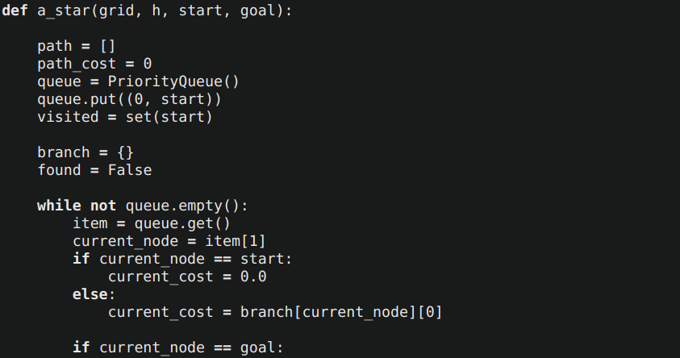
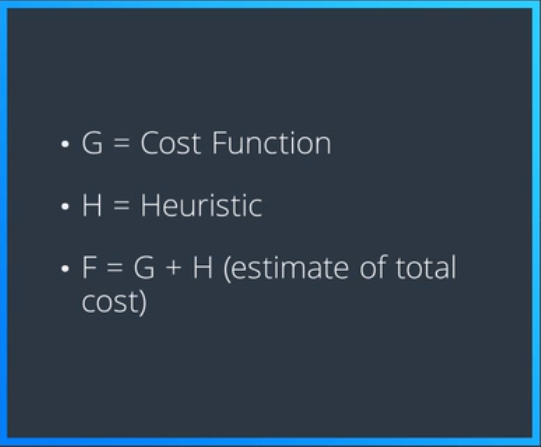
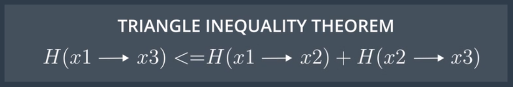

# AAE_Notebook_001_AStarSearch
This Jupyter Notebook forms a simple implementation of the [A* Search Algorithm](https://en.wikipedia.org/wiki/A*_search_algorithm) in Python.

Given the Cost function (G), which is the sum of the actions we've thusfar taken, and the Heuristic function (H), which is an underestimate of the remaining cost to get from the last state of our partial plan to the goal, we can add together both the Cost and the Heuristic. We now have a total cost to get from the start to the goal, despite not knowing exactly how to get to the goal. (F = G + H)

Since the Heuristic /must/ obey the Triangle Inequality Theorem (stating for any three points, X1, X2, X3, the heuristic estimate for X1->X3 has to be less than the heuristic estimate for X1->X2 plus the heuristic estimate of X2->X3) making the Heuristic "consistent".

In adding the Heuristic (underestimated remaining cost) to the Cost (sum of actions thusfar taken) of each partial plan, we can determine how to expand each partial plan... Until we arrive at the optimal plan for reaching the goal.

